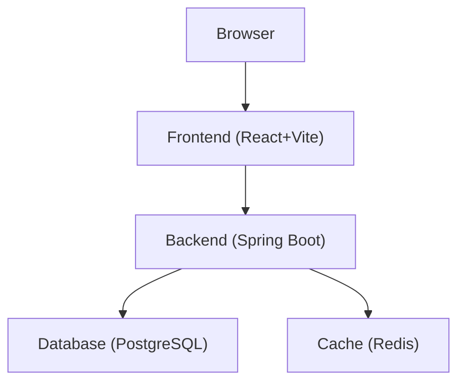

# Three-Tier-Architecture-demo

3層WEBアプリケーション（フロントエンド/バックエンド/データベース+キャッシュ）の構成を体験できるデモアプリです。
Dockerを利用してローカル環境で簡単に起動できます。

---

## システム構成図



### ■ 構成の説明

* **Frontend (React+Vite)**
  ユーザー操作を受け取り、APIを通じてバックエンドと通信

* **Backend (Spring Boot)**
  ビジネスロジックを担当し、DBやRedisへアクセス

* **Database (PostgreSQL)**
  永続データを保存

* **Cache (Redis)**
  一時データ（セッションやDBアクセス結果のキャッシュ）を保存

---

## 前提条件

* Docker Desktop がインストール済みであること

---

## アプリの起動方法

### 1. Docker Desktopの起動  

### 2. Dockerコンテナの起動

```bash
# コンテナ起動
docker compose up -d
```
※初回起動時はイメージのダウンロードにより数分かかる場合があります。

---

## 使い方

### 1. ブラウザでアクセス
`http://localhost:5173/`にアクセスします。

### 2. 操作を実行
画面左下の「操作画面」から、アカウント登録やログインなどの操作を行います。

### 3.　リクエストの流れを確認
画面右下の「リクエストフロー」に、操作に応じたリクエストの流れ（フロントエンド → バックエンド → データベース など）が可視化されます。

---

## 画面別の操作例

### アカウント登録画面

#### 正常系

* ユーザー名・パスワードを入力して登録する  
  → アカウント登録が成功し、ユーザー情報がデータベースに保存されます

#### 異常系

* ユーザー名・パスワード未入力で登録  
  → バリデーションエラーが表示されます    　　

* ユーザー名・パスワードが入力規則を満たさない  
  → バリデーションエラーが表示されます  

* 既に存在するユーザー名で登録  
  → 重複エラーが表示されます  
  → 一定回数以降はキャッシュ（Redis）からユーザー情報を取得するようになります

---

### ログイン画面

#### 正常系

* 登録済みユーザーでログイン  
  → データベースからユーザー情報を取得し、認証が成功します  
  → 「マイページへ」をクリックするとマイページに遷移します  
  → 一定回数以降はキャッシュ（Redis）からユーザー情報を取得するようになります  

#### 異常系

* 存在しないユーザーでログイン  
  → 認証エラーが表示されます  

* パスワードが誤っている場合  
  → 認証エラーが表示されます

* ユーザー名・パスワード未入力でログイン  
  → バリデーションエラーが表示されます

---

### マイページ

#### 正常系

* ユーザー名変更  
  → ユーザー名が更新されます  
  → 更新に伴いキャッシュ（Redis）のデータが削除されます

* パスワード変更  
  → パスワードが更新されます  
  → 更新に伴いキャッシュ（Redis）のデータが削除されます

* ログアウト  

  → セッションが無効化されます

* アカウント削除  
  → アカウントが削除されます

#### 異常系

* 既に存在するユーザー名に変更  
  → 重複エラーが表示されます  
  → 一定回数以降はキャッシュ（Redis）からユーザー情報を取得するようになります

* ユーザー名・パスワードが入力規則を満たさない  
  → バリデーションエラーが表示されます

* ログアウト後に操作を実行（ユーザー名変更・パスワード変更・アカウント削除）  
→ 認証エラーが表示されます

---

## パスワードを忘れた場合

現在、このアプリではパスワードリセット機能は実装されていません。
そのため、パスワードを忘れた場合は**データベースとキャッシュのユーザー情報を手動で削除**する必要があります。

---

### データベースのユーザー情報を削除

```bash
# データベースコンテナにログイン
docker exec -it db psql -U demo -d demo
```

```sql
-- ユーザー一覧を確認
SELECT * FROM users;

-- 特定のユーザーを削除する場合
DELETE FROM users WHERE username = 'ユーザー名';

-- 全てのユーザーを削除する場合(データベースリセット)
TRUNCATE TABLE users RESTART IDENTITY;

-- 削除結果確認
SELECT * FROM users;
```

---

### キャッシュの情報を削除

```bash
# キャッシュ（Redis）コンテナにログイン
docker exec -it cache redis-cli

# キャッシュキー一覧を確認
KEYS *

# キャッシュを全削除
FLUSHALL

# 削除結果確認
KEYS *
```

---

### 注意事項

* `TRUNCATE` および `FLUSHALL` は**全データを削除する危険なコマンド**です
* 本番環境では絶対に実行しないでください
* あくまでローカル開発環境での利用を想定しています

---

## アプリの停止方法

```bash
# コンテナ起動
docker compose down
```

---
